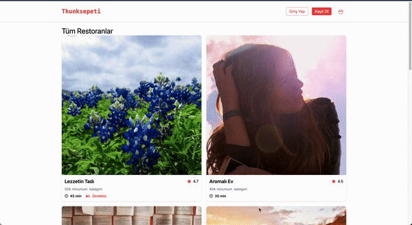

# Thunk Cart

**Thunk Cart** is a food ordering application built using React. Users can select a venue and add or remove meals from their cart, with the ability to adjust quantities for each item. The project uses **Redux Thunk** for managing asynchronous logic and global state.

## Features

- **Venue Selection**: Users can choose from a list of venues to view available meals.
- **Add to Cart**: Meals can be added to the shopping cart in desired quantities.
- **Cart Management**: Users can increase, decrease, or remove items from the cart.
- **State Management**: Uses **Redux** and **Redux Thunk** to handle global state and asynchronous actions.
- **Routing**: Implemented with **React Router DOM** for seamless navigation.
- **Icons**: Enhanced UI using **React Icons** for interactive and user-friendly design.
- **Mock API**: **json-server** is used to simulate a backend for fetching venues and meals.

## Technologies Used

- **React**: Frontend library for building UI components.
- **Redux**: Manages the global state of the application.
- **Redux Thunk**: Middleware for handling async logic in Redux.
- **React Router DOM**: Enables client-side routing.
- **Axios**: For making HTTP requests to the mock API.
- **React Icons**: Provides icon components to enhance the user interface.
- **uuid**: For generating unique IDs for cart items.
- **json-server**: Used to create a mock REST API.

